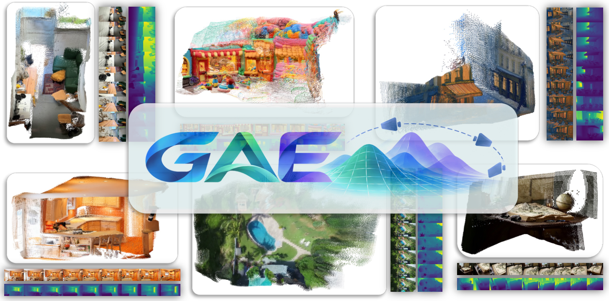

# GAE: Learning a Geometry-Native Latent Space for 3D-Consistent World Generation

<p align="center">
  <a href="https://arxiv.org/abs/2609.24981"></a> &nbsp;
  <a href="https://jiah-cloud.github.io/GAE.github.io/"></a> &nbsp;
  <a href="https://huggingface.co/TencentARC/GAE-D64-1B"></a> &nbsp;
  <a href="https://www.youtube.com/watch?v=DpPD85IK-Ko"></a>
</p>

<p align="center">
<a href="https://github.com/jiah-cloud"><b>Jiahao Lu</b></a><sup>1*</sup> &ensp;
<a href="https://github.com/TencentARC/GAE-GeometricAutoEncoder"><b>Minghao Yin</b></a><sup>2,3*</sup> &ensp;
<a href="https://wbhu.github.io/"><b>Wenbo Hu</b></a><sup>2†</sup> &ensp;
<a href="https://liuhengyu321.github.io/"><b>Hengyu Liu</b></a><sup>4</sup><br>
<a href="https://thuzhaowang.github.io/"><b>Wang Zhao</b></a><sup>2</sup> &ensp;
<a href="https://saikit.org/index.html"><b>Sai-Kit Yeung</b></a><sup>1</sup> &ensp;
<a href="https://scholar.google.com/citations?user=4oXBp9UAAAAJ&amp;hl=en"><b>Ying Shan</b></a><sup>2</sup> &ensp;
<a href="https://liuyuan-pal.github.io/"><b>Yuan Liu</b></a><sup>1†</sup>
</p>

<p align="center">
<sup>1</sup>The Hong Kong University of Science and Technology
&ensp;·&ensp;
<sup>2</sup>ARC Lab, Tencent IEG<br>
<sup>3</sup>The University of Hong Kong
&ensp;·&ensp;
<sup>4</sup>The University of Texas at Austin
</p>

<p align="center">
<sup>*</sup>Equal contribution
&emsp;
<sup>†</sup>Corresponding authors
</p>

<p align="center">
  
</p>

GAE puts the 3D inductive bias into the *generated state itself*. Instead of
encoding a frame as an image and adding geometry from outside the latent, it
compresses frozen geometry-foundation features into a compact per-view latent
whose generated states decode jointly into **RGB and geometry**.

This is the public code release for the paper. Use `gae/` for inference,
`scripts/demo/` / `scripts/train/` / `scripts/eval/` / `scripts/data/` for the
CLIs, and `configs/` for the recipes.
Internal research filenames are documented in [`docs/CODEBASE.md`](docs/CODEBASE.md)
and [`docs/METHOD.md`](docs/METHOD.md); you do not need them to run GAE.

---

## 🔆 How it works

Two stages, matching Sections 3.1 and 3.2–3.3 of the paper.

**Stage 1 — the codec.** Depth Anything 3 (DA3) is frozen at both ends: its
encoder produces a four-level feature hierarchy, and its DPT head reads depth,
rays and point maps back out. GAE learns the state *in between*:

```
images ──frozen DA3 encoder──> 4-level features ──level-wise normalize + concat──> X
   X ──GAECodec.encode──> z  (64 or 128 channels, DA3 patch grid)
   z ──GAECodec.decode──> rebuilt 4 levels ──frozen DPT head──> depth / rays / pointmap
   z ──learned RGB head──> RGB
```

Because the geometry head never trains, geometry reconstruction has to stay
readable by the model the features came from. That is a real constraint, not a
soft one.

Reconstruction alone does not organize the bottleneck for generation, so the
loss also shapes it (Eqs. 8–10):

| term | what it does |
|---|---|
| `L_tok` | aligns each projected posterior token with C-RADIOv2.5-B; improves transport smoothness and semantic organization |
| `L_struct` | matches DINOv2-L patch–patch similarity directly in the **raw posterior mean**; restores the spatial and cross-view structure that token-only alignment collapses |

Both act on the codec bottleneck *before* the flow model is trained, unlike
REPA which aligns intermediate denoiser states during generative training.

**Stage 2 — the flow model.** The codec is frozen, its posterior mean is
standardized per channel, and one conditional flow model is trained over that
state with RAEv2-style x-prediction (Eq. 11). Three controls specify the state
without evolving with it:

* **clean reference latents** — *evidence rather than state* (Eq. 14). DA3 is
  set-based, so a reference encoded alongside target views cannot be reproduced
  at inference. GAE therefore encodes observed references exactly as at
  inference and prepends them as clean tokens at `t=0`; their outputs are
  discarded before the prediction head, and only generated views are integrated.
* **metric Plücker ray maps** — camera motion as a scale-aware control (Eq. 13).
* **text**, via cross-attention.

The same backbone therefore covers text-to-image, camera-controlled video, and
reference-conditioned novel-view synthesis.

---

## ⚙️ Install

```bash
python -m venv .venv && source .venv/bin/activate
pip install -e .            # installs the `gae` API and the src/ modules
# or, for a pinned CUDA env:  pip install -r requirements.txt
```

If `python -m venv .venv` fails with `Operation not permitted` on `lib64`, the
checkout is on a filesystem that rejects the venv symlink — create the env on
local disk instead (`python -m venv /tmp/gae-venv && source /tmp/gae-venv/bin/activate`).
`run_demo.sh` does that automatically (`GAE_VENV` overrides the location).

Python 3.10–3.12, torch 2.5.1. The DA3-GIANT backbone is pulled from the Hub
on first use. `python3.13` is not supported (`pip install -e .` will refuse it).

`pip install -e .` puts both `gae` and the research packages (`stage1`,
`stage2`, `utils`, ...) on the import path, so **no `PYTHONPATH` setup is
needed**. The scripts still add `src/` themselves, so they also run from a plain
`pip install -r requirements.txt` checkout.

---

## 💫 Inference

The released weights turn **one image + a prompt into a multi-view video with a
consistent 3D point cloud**, or a **prompt into a single image** — the same
validated Euler + CFG sampler in both cases. This is the fastest way to see GAE
work; the training and evaluation workflows follow in the next section.

Weights live at [`TencentARC/GAE-D64-1B`](https://huggingface.co/TencentARC/GAE-D64-1B).
`bash scripts/demo/run_demo.sh` creates a venv if needed (on the local disk
when the checkout cannot host the `lib64` symlink), installs the package,
downloads those weights when `ckpts/` is empty, then runs the bundled examples
(`examples/scenes/` plus `examples/t2i_prompts.txt`):

```bash
bash scripts/demo/run_demo.sh
bash scripts/demo/run_demo.sh --smoke          # 17 views, 25 steps
bash scripts/demo/run_demo.sh --task i2v
```

Results go to `results/demo/i2v/<scene>/` and `results/demo/t2i/`.
`bash scripts/demo/run_demo.sh --help` lists flags. Extra arguments after `--` are
forwarded to `scripts/demo/generate.py`.

### 🎬 Video + point cloud from one image and prompt

```bash
python scripts/demo/generate.py \
  --image examples/scenes/forest_lake_trail.jpg \
  --prompt-file examples/scenes/forest_lake_trail.txt \
  --hf-repo TencentARC/GAE-D64-1B \
  --output results/forest --total-views 81
```

Weights are fetched from Hugging Face on first run (cached under `ckpts/`).
This writes the generated MP4, trajectory visualization and `.ply` point cloud.
For dataset-scale generation metrics (FVD / FID / 3D-consistency / MEt3R) see
[Training & evaluation](#-training--evaluation) below.

### 🖼️ Image from a prompt (single frame)

```bash
python scripts/demo/generate_t2i.py \
  --hf-repo TencentARC/GAE-D64-1B \
  --prompts-file examples/t2i_prompts.txt \
  --output results/t2i
```

This drives the same sampler as the video generation above with a single view
and no camera rays, then decodes RGB through the codec's RGB head (trained by
the `t2i` co-train branch). Guidance defaults to internal guidance (`--guidance ig`,
`--ig-scale 2`). By default each PNG is also paired with a DPT
`_depth.png` and `_pointcloud.ply` (pass `--no-pointcloud` to skip). Pass
`--prompts "a;;b"` or `--prompts-file` and
`--num-images N` for batches. A curated prompt list plus sample outputs live in
[`examples/t2i_prompts.txt`](examples/t2i_prompts.txt) and [`examples/t2i_samples/`](examples/t2i_samples).

---

## 🤗 Hugging Face Space

This repository includes a Gradio Space app in [`app.py`](app.py). It has two tabs:

- **Image → camera-controlled video**: uses the images, prompts, and matching camera poses in `examples/scenes/`; uploaded images use the selectable synthetic trajectories.
- **Text → image**: uses the prompts in `examples/t2i_prompts.txt` and decodes depth plus a point cloud alongside the generated image.

To deploy it, create a new Gradio Space and upload/push this repository. The Space downloads `TencentARC/GAE-D64-1B` on the first request. A GPU-backed Space is recommended; start with 17 views and 25 sampling steps, then increase to 81 views for the full camera-controlled clip.

The local equivalent is:

```bash
python app.py
```

## 🐍 Python API

Use this when you want tensors in your own code rather than writing videos from
the command line.

```python
from gae import GAE

gae_model = GAE.from_pretrained("TencentARC/GAE-D64-1B")
# or: GAE.from_configs(codec_cfg=..., codec_ckpt=..., flow_cfg=..., flow_ckpt=...)

images = load_your_images()          # [B, V, 3, H, W] in [0, 1]
z = gae_model.encode(images)         # [B, V, C, h, w]  posterior mean
out = gae_model.reconstruct(images)  # {'rgb': ..., 'depth': ...}
```

`GAE.sample()` is the Euler + CFG sampler on tensors (reference latents, Plücker
rays, and text). A short script that also writes RGB, depth, and a `.ply` is
[`examples/generate_min.py`](examples/generate_min.py).

---

## 🚀 Training & evaluation

For most users the two wrapper scripts below are enough — the steps afterwards
are the underlying commands, useful when you need to customize a run.

```bash
# --- one-click training ---------------------------------------------------
# Stage 1 codec, Stage 2 flow, or both. `both` runs codec -> latent stats -> flow.
scripts/train/run_train.sh --stage codec --size 64  --gpus 8
scripts/train/run_train.sh --stage flow  --size 128 --gpus 8 --cotrain-t2i   # i2v + T2I
scripts/train/run_train.sh --stage both  --size 64

# --- one-click evaluation -------------------------------------------------
# Default tasks (recon,latent,gen) need only the shipped GAE ckpts + data.
scripts/eval/run_eval.sh --size 64
scripts/eval/run_eval.sh --size 128 --tasks recon,latent --dataset dl3dv_packed
# 3D-consistency / MEt3R / geometry additionally need external recon models,
# supplied through env vars:
VGGT_CKPT=ckpts/vggt.pt PI3_CKPT=ckpts/pi3.pt \
  scripts/eval/run_eval.sh --size 64 --tasks gen,consistency,met3r,geometry
```

Run them from the repository root with `GAE_DATA_ROOT` set (see **Prepare
RealEstate10K or DL3DV** below). `scripts/train/run_train.sh --help` /
`scripts/eval/run_eval.sh --help` list every flag; both forward extra arguments
to the underlying Python entry points documented below. A per-script command reference lives in
[`scripts/README.md`](scripts/README.md).

### Prepare RealEstate10K or DL3DV

```bash
# Raw RE10K: <source>/{train,test}/<shard>/<scene>/{*.png,transforms.json}
python scripts/data/prepare_data.py re10k \
  --source /datasets/RealEstate10K --output "$GAE_DATA_ROOT/re10k_packed" \
  --split train --workers 8

# Raw DL3DV: <source>/<split>/<scene>/[nerfstudio/]/{images_4,transforms.json}
python scripts/data/prepare_data.py dl3dv \
  --source /datasets/DL3DV-10K --output "$GAE_DATA_ROOT/dl3dv_packed" \
  --workers 8


# ScanNet++ (own loader + depth sidecar) and MVS-Synth (VideoMetaScene schema)
python scripts/data/preprocess_scannetpp.py \
  --source /datasets/scannetpp --output "$GAE_DATA_ROOT/scannetpp_preprocessed" \
  --num-shards 8 --shard-index 0
python scripts/data/preprocess_mvssynth.py \
  --source /datasets/MVS-Synth/GTAV_540 --output "$GAE_DATA_ROOT/mvssynth_packed"

# Required before Flow/DiT training
python scripts/data/export_da3_metric_poses.py \
  --dataset re10k_packed --root "$GAE_DATA_ROOT/re10k_packed" \
  --device cuda:0 --skip-existing
```

Both produce `<scene>/{video.mp4,meta.json,caption.txt}`. For the optional
text-to-image co-training data (BLIP3o + ImageNet-1k) use
`scripts/data/prepare_t2i_data.py`. See [`docs/DATA.md`](docs/DATA.md).

### Train the GAE-64 / GAE-128 codec or the flow model

```bash
# Recommended: automatically runs codec -> latent statistics -> Flow/DiT
scripts/train/run_train.sh --stage both --size 64 --gpus 8
scripts/train/run_train.sh --stage both --size 128 --gpus 8 --cotrain-t2i
```

To run the stages separately with the Python entry points:

```bash
# 1. Train the GAE-64 codec
python scripts/train/train.py codec --size 64 --gpus 8

# 2. Set this to the checkpoint produced by Step 1, then compute statistics
CODEC_CKPT=/path/to/trained_gae_64_checkpoint.pt
python scripts/train/compute_latent_stats.py \
  --config configs/gae_64.yaml --codec-ckpt "$CODEC_CKPT" \
  --num-batches 500 --output ckpts/latent_stats_gae_64.pt

# 3. Train Flow/DiT with the same frozen codec
python scripts/train/train.py flow --size 64 --gpus 8 --vae-ckpt "$CODEC_CKPT"
```

The same sequence applies to GAE-128 by using `configs/gae_128.yaml`,
`ckpts/latent_stats_gae_128.pt`, and `--size 128`.

`--gpus` is the number of GPU processes per node. Multi-node training launches
the same command on every node with a unique `--node-rank`:

```bash
# node 0 (10.0.0.1)
python scripts/train/train.py codec --size 64 --gpus 8 --nnodes 2 --node-rank 0 --master-addr 10.0.0.1 --master-port 29500

# node 1
python scripts/train/train.py codec --size 64 --gpus 8 --nnodes 2 --node-rank 1 --master-addr 10.0.0.1 --master-port 29500
```

All nodes must see equivalent datasets/configs. Use a shared results directory when checkpoints must persist beyond node-local storage.
The underlying entry points remain `scripts/train/train_codec.py` and
`scripts/train/train_flow.py`; pass extra trainer arguments after `--`. Text-to-image is not a separate stage: it is
co-trained *inside* the flow (i2v/t2v) model via `--cotrain-t2i`, which
interleaves single-image T2I steps into the multi-view loop (data prepared in
**Prepare RealEstate10K or DL3DV**; see [`docs/DATA.md`](docs/DATA.md)). The
codec keeps an optional `cotrain_t2i` block of its own (`COTRAIN_T2I=1`) for
RGB-decoder text alignment.


On network filesystems, run `python scripts/data/build_dataset_index.py --config
configs/gae_64.yaml` once beforehand to pre-build the loader index caches so rank0
does not block `torchrun` on a cold scan (idempotent, safe to re-run).

### Evaluate codec reconstruction and latent properties

```bash
# RGB, feature, depth and camera/geometry reconstruction
python scripts/eval/eval_reconstruction.py \
  --config configs/gae_64.yaml --vae-ckpt ckpts/gae_64.pt \
  --dataset re10k_packed --data-root "$GAE_DATA_ROOT/re10k_packed/test"

# Encode posterior means, then measure rho/kappa/rank/LNC/LDS/CDS
python scripts/eval/encode_latents.py \
  --input "$GAE_DATA_ROOT/re10k_packed/test" \
  --config configs/gae_64.yaml --codec-ckpt ckpts/gae_64.pt \
  --output results/re10k_gae64_latents.pt
python scripts/eval/eval_latent.py \
  --latents gae64=results/re10k_gae64_latents.pt \
  --json results/re10k_gae64_latent_metrics.json
```

`eval_reconstruction.py` evaluates geometry decoded by the frozen DA3 DPT head
(depth and recovered camera trajectory). Use `eval_geometry.py` on dumped
`*_geom.npz` files for Chamfer and point-map metrics. For camera-conditioned
generation quality and 3D consistency see **Evaluate generation quality** below.

### Evaluate generation quality

```bash
# 1) Camera-conditioned generation -> Table 5 (FVD / FID / LPIPS / PSNR / SSIM);
#    also dumps point clouds + geometry for the 3D metrics below.
python scripts/eval/eval_generation.py \
  --config configs/flow_gae64.yaml \
  --dit-ckpt ckpts/flow_gae64.pt --vae-ckpt ckpts/gae_64.pt \
  --dataset re10k_packed --data-root "$GAE_DATA_ROOT/re10k_packed" \
  --mode generate --cond-num 1 --num-scenes 64 --num-views 9 \
  --sample-steps 50 --cfg-scale 2.0 \
  --output-dir results/gen_gae64 --save-pointcloud --dump-geometry

# 2) Generated-view 3D consistency + MEt3R -> Table 6 (needs external recon models)
python scripts/eval/eval_3d_consistency.py \
  --pred-dir results/gen_gae64 \
  --dataset re10k_packed --data-root "$GAE_DATA_ROOT/re10k_packed" \
  --vggt-ckpt ckpts/vggt.pt --da3-ckpt ckpts/da3_giant.pt \
  --output-name results/gen_gae64/consistency.json
python scripts/eval/eval_met3r.py --pred-dir results/gen_gae64 \
  --output results/gen_gae64/met3r.json

# 3) Geometry decoded from sampled latents -> Table 7 (needs Pi3)
python scripts/eval/eval_geometry.py \
  --geom-dir results/gen_gae64 --pi3-ckpt ckpts/pi3.pt \
  --output-name results/gen_gae64/geometry.json
```

Steps 2–3 consume the `--output-dir` from step 1. Use `configs/flow_gae128.yaml`
+ the `*_128` checkpoints for GAE-128, and `--dataset dl3dv_packed` for DL3DV.
`--vggt-ckpt` / `--da3-ckpt` / `--pi3-ckpt` are external evaluator weights (not
shipped here). The default `--num-scenes 4 --num-views 8` is a smoke setting; the
paper protocol is 64 scenes × 9 views, 1 reference, 50 steps, CFG 2. Because the
released flow weights are a stronger continued-training model these will not
reproduce the paper numbers exactly — see [Results](#-results). One-click
equivalent: `scripts/eval/run_eval.sh --size 64 --tasks gen,consistency,met3r,geometry`.


---

## 📊 Results

Refer to the paper for the reported numbers in each table; they were not
re-measured in this repository. [`docs/METHOD.md`](docs/METHOD.md) maps every
equation in the paper to the code that implements it, and every table has a
matching `scripts/eval/eval_*.py` (see the eval steps above).

**Checkpoint provenance — read before comparing to the paper.** The paper's
*generation* tables (5, 6, 7) were produced by the specific research flow model
used at submission time. The **released** `flow_gae{64,128}.pt` are a *stronger
continued-training* model — larger resolution, more frames, and more training
data. Consequently `scripts/eval/eval_generation.py`, `eval_3d_consistency.py`,
`eval_met3r.py`, and `eval_geometry.py` will **not** reproduce the exact
paper numbers on these weights; they are expected to match or exceed them.
Reproducing Tables 5–7 verbatim requires the original research checkpoint,
which is not part of this release.

The *latent-diagnostic* (Tables 1, 2 — `scripts/eval/eval_latent.py`) and
*reconstruction* (Tables 3, 4 — `scripts/eval/eval_reconstruction.py`,
`scripts/eval/eval_geometry.py`) metrics depend only on the codec
(`gae_{64,128}.pt`), not the flow model, so they are unaffected by the flow
continued-training and track the paper's codec results directly.

---

## 📁 Layout

```
gae/                      public API (GAE, load_codec, load_flow)
assets/                   teaser figure
configs/                  gae_{64,128}.yaml, flow_gae{64,128}.yaml
scripts/demo/             run_demo.sh, generate.py, generate_t2i.py
scripts/train/            train_codec, train_flow, run_train.sh
scripts/eval/             eval_*, smoke_test, run_eval.sh
scripts/data/             packing, preprocessing, DA3 poses
src/stage1/               GAECodec + frozen DA3
src/stage2/models/dit*.py GAEFlow / GAEFlowTemporal
src/utils/train_runtime.py  DDP / ckpt / latent-stats helpers
docs/                     METHOD.md, DATA.md, CODEBASE.md
```

See [`docs/CODEBASE.md`](docs/CODEBASE.md) for files that exist only for
checkpoint compatibility (DiT-v4 inheritance, old trainer modules, GAN stub).

---

## 📝 Citation

If you find GAE useful in your research, please cite:

```bibtex
@misc{lu2026gaelearninggeometrynativelatent,
      title={GAE: Learning a Geometry-Native Latent Space for 3D-Consistent World Generation}, 
      author={Jiahao Lu and Minghao Yin and Wenbo Hu and Hengyu Liu and Wang Zhao and Sai-Kit Yeung and Ying Shan and Yuan Liu},
      year={2026},
      eprint={2609.24981},
      archivePrefix={arXiv},
      primaryClass={cs.CV},
      url={https://arxiv.org/abs/2609.24981}, 
}
```

## 📄 License

See [LICENSE.txt](LICENSE.txt) for the terms of use.
