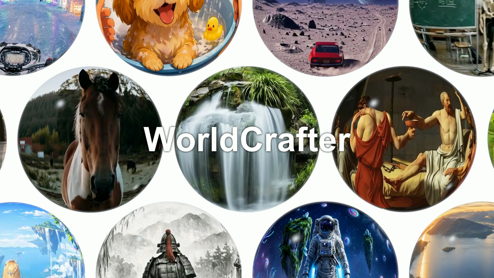

# WorldCrafter: Consistent Video World Model with Implicit 3D-aware Memory

<p align="center">
  <a href="https://arxiv.org/abs/2609.24984"></a> &nbsp;
  <a href="https://drexubery.github.io/WorldCrafter/"></a> &nbsp;
  <a href="https://www.youtube.com/watch?v=sg09ftQOl0E&amp;t=5s"></a> &nbsp;
  <a href="https://huggingface.co/TencentARC/WorldCrafter-Fast"></a>
</p>

🤗 If you find WorldCrafter useful, please consider giving this repo a ⭐. Your support helps us share and improve the project. Thank you!

## 🔆 Introduction

WorldCrafter enables consistent, camera-controlled scene exploration from an image or text prompt. Its camera-queryable implicit 3D-aware memory preserves scene information across viewpoints and over long horizons.

We provide **WorldCrafter-Base** and **WorldCrafter-Fast**, a distilled model for faster inference. 

## 🎬 Video Demos

[](https://www.youtube.com/watch?v=sg09ftQOl0E&t=5s)

## ⚙️ Setup

### 1. Clone WorldCrafter

```bash
git clone https://github.com/TencentARC/WorldCrafter.git
cd WorldCrafter
```

### 2. Environment

Use Python 3.11 on Linux with an NVIDIA GPU and a compatible driver.

**Option A: uv (recommended)**

Install [uv](https://docs.astral.sh/uv/getting-started/installation/), then run
from the repository root:

```bash
uv sync --project uvenv --frozen
source uvenv/.venv/bin/activate
```

This installs the locked PyTorch 2.10 / CUDA 12.8 environment and its
acceleration dependencies.

**Option B: conda + pip**

Create an environment and install PyTorch for your machine. For CUDA 12.8:

```bash
conda create -n worldcrafter python=3.11 pip -y
conda activate worldcrafter
python -m pip install torch==2.10.0 torchvision==0.25.0 \
  --index-url https://download.pytorch.org/whl/cu128
python -m pip install -e .
```

Choose the appropriate CUDA build from the
[PyTorch installation commands](https://pytorch.org/get-started/previous-versions/#v2100).
The default attention backend uses PyTorch; FlashAttention is not required.

Both options support Base, Fast, and the interactive demo. See
[uvenv/README.md](uvenv/README.md) for optional dependencies.

### 3. Model weights

| Models | Download Link | Notes |
| --- | --- | --- |
| WorldCrafter-Base | 🤗 [Hugging Face](https://huggingface.co/TencentARC/WorldCrafter-Base) | Base model |
| WorldCrafter-Fast | 🤗 [Hugging Face](https://huggingface.co/TencentARC/WorldCrafter-Fast) | Distilled high- and low-noise models for faster inference |

Download weights with the Hugging Face CLI:

```bash
hf download TencentARC/WorldCrafter-Fast --local-dir weights/WorldCrafter-Fast

# Optional: also download Base to run the base model
hf download TencentARC/WorldCrafter-Base --local-dir weights/WorldCrafter-Base
```

Base model uses shared components from `WorldCrafter-Fast`, so keep both folders when using base model.

## 💫 Inference

### 1. Image-to-video

See the [inference guide](test/README.md) for camera controls, prompt writing, and examples.

Run with either model:

```bash
# Base
python inference.py --output-path output/base.mp4

# Fast
python inference.py --model-type fast --output-path output/fast.mp4
```

Fast supports image-to-video and text-to-video at 384 × 640. Resuming a previous rollout is currently supported only by Base.

### 2. Text-to-video

```bash
# Base
python inference.py --mode t2v --output-path output/t2v.mp4

# Fast
python inference.py --model-type fast --mode t2v --output-path output/fast_t2v.mp4
```

Compilation is **off by default**. Add `--enable-compile` to enable it; the first run takes longer to start.

### 3. Custom inputs

```bash
python inference.py \
  --image-path path/to/image.png \
  --camera-path path/to/camera.npy \
  --prompt "Your scene description" \
  --output-path output/custom.mp4
```

Camera trajectories use global camera-to-world matrices in `[T, 3, 4]` or `[T, 4, 4]` NumPy arrays, with metric translations and 33 frames per chunk. Use `--num-chunks` to limit the rollout and `--chunk-output-dir` to save individual chunks.

### 4. Camera actions

Instead of `--camera-path`, describe a trajectory with actions:

```bash
python inference.py --model-type fast --actions "forward1x2 yaw_left30x3 backward1"
```

This generates six 33-frame chunks. Use `--actions-file actions.txt` for a saved
sequence, or generate camera poses separately:

```bash
python tools/build_trajectory.py --actions-file actions.txt --output-dir output/trajectory
python inference.py --model-type fast --camera-path output/trajectory/camera.npy
```

Choose one of `--camera-path`, `--actions`, or `--actions-file`.

Without `--output-path`, each run writes `video.mp4` and its metadata under
`output/<model>/<mode>/<run-id>/`. Use `--output-path` to choose an explicit filename.

Run `python inference.py --help` for all options.

## 🎮 Interactive Demo

> The interactive demo is currently being debugged.

Install the [demo dependencies](uvenv/README.md#interactive-demo), then explore
a scene with keyboard camera controls from your activated environment:

```bash
python -m demo --model-path weights/WorldCrafter-Fast
```

Open `http://localhost:8080`. The single-GPU demo uses Fast image-to-video with
compilation enabled. See [demo/README.md](demo/README.md) for controls and deployment.

## 📝 Citation

If you find WorldCrafter useful in your research, please cite:

```bibtex
@misc{yu2026worldcrafter,
  title={WorldCrafter: Consistent Video World Model with Implicit {3D}-aware Memory},
  author={Wangbo Yu and Kunhao Liu and Wenbo Hu and Shenghai Yuan and Chaoran Feng and Haiyang Zhou and Yukun Huang and Yiran Wang and Wang Zhao and Yingmin Luo and Ying Shan},
  year={2026},
  eprint={2609.24984},
  archivePrefix={arXiv},
  primaryClass={cs.CV},
  url={https://arxiv.org/abs/2609.24984}
}
```

## 📄 License

See [LICENSE.txt](LICENSE.txt) for the terms of use and third-party attributions.

## 🤗 Related Works

[Helios](https://github.com/PKU-YuanGroup/Helios),
[LagerNVS](https://github.com/facebookresearch/lagernvs),
[DreamX-World](https://github.com/AMAP-ML/DreamX-World),
[EVOKE](https://github.com/AlayaLab/Evoke),
[HY-WorldPlay](https://github.com/Tencent-Hunyuan/HY-WorldPlay),
[Lyra 2.0](https://github.com/nv-tlabs/lyra/tree/main/Lyra-2),
[Echo-WM](https://github.com/jd-opensource/JoyAI-Echo/tree/main/echo_wm),
[LingBot-World 2](https://github.com/robbyant/lingbot-world-v2),
[Matrix-Game 3.5](https://github.com/Riemann-Dynamics/Matrix-Game-3.5),
[SANA-WM](https://github.com/NVlabs/Sana/blob/main/docs/sana_wm.md).
