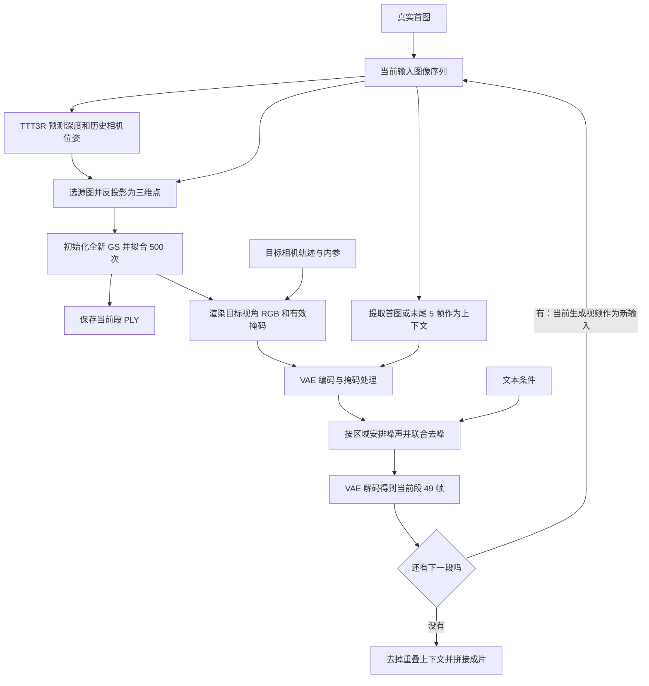

# WorldWarp 详细推理流程：从首帧到分段视频

记录日期：2026-09-18。

本文整理本地 WorldWarp 原版的实际执行流程，以最近的 DL3DV 单场景运行配置为例：**225 帧、720×480、5 段、每段 49 帧、首段上下文 1 帧、后续上下文 5 帧、30 fps、50 步采样、CFG 5、strength .8、seed 32、每段 GS 拟合 500 次**。最终视频为 7.5 秒。

这些数字对应独立的 DL3DV benchmark 配置，不应与普通 classroom 的 321 帧、10.7 秒配置混用。本文说明流程，不代表该场景已成功复现论文质量；最近重验的执行和指标计算已完成，但视觉质量验收未通过。

整个系统包含两种计算：

- **几何重建与渲染**：TTT3R 估计几何，3D Gaussian Splatting（GS）把已有画面转换到目标视角。
- **视频生成**：WorldWarp 的视频扩散模型根据粗渲染补全画面，并生成连续视频。

它们通过图像、深度、相机和掩码衔接。**本次推理会优化场景高斯参数，但不会微调视频生成模型的权重。每段重新初始化、重新拟合一份高斯，没有持续优化同一个全局高斯模型。**

## 1. 输入不只有首图，还要指定相机怎么走

生成一段有指定视角变化的视频，需要以下输入。

| 输入 | 作用 |
|---|---|
| 首帧 RGB 图像 | 提供场景最初的外观信息 |
| 目标相机位姿序列 | 指定每一帧相机的位置和朝向 |
| 相机内参 K | 指定焦距、主点，决定如何投影 |
| 场景描述文本 | 给视频模型提供内容提示 |
| 生成配置 | 段数、采样步数、引导强度、随机种子等 |

这里要区分两种相机信息：

- **目标相机**：希望视频按什么轨迹运动。
- **重建相机**：TTT3R 根据输入画面估计这些画面实际对应什么视角，用于重建几何。

普通“给首图、向左转”的任务，目标轨迹由程序构造。此次 DL3DV 评测的原版分支，则先从真实参考视频估计目标相机轨迹；GT 视频还用于最后计算指标。**评测提供了参考轨迹，但没有把后续 GT 图像作为生成时的场景观测，也没有用 GT 深度拟合生成用的高斯。**

因此，下面说“只用首图”，指的是生成的初始场景外观来源。另一次使用数据集标定相机的运行属于显式诊断配置，与这里的原版相机来源应分开。

## 2. 首图经过 TTT3R，得到可用于三维重建的预测

首段将输入图重复成 49 帧，以适配视频接口。重复并不会增加真实观测信息。

TTT3R 处理后，接口返回：

| 输出 | 含义 |
|---|---|
| 深度图 D | 每个像素对应的点，在相机坐标系中的 Z 深度 |
| 相机位姿 | 预测输入各帧的相机位置和朝向 |
| 相机内参 | 预测焦距等投影参数 |

更具体地说，本地实现从模型预测的**相机坐标系三维点图**中取 Z 分量作为深度，并恢复到输入图像尺寸。

此时得到的是可见表面的预测几何。例如，一张教室照片可以估计桌面、地面、墙面的深度，但并没有直接观测桌子背后、墙角外侧等区域。

一个实现细节是：**TTT3R 返回内参，不意味着下游全部使用这次返回的内参。** 本地 GS 调用使用传入的轨迹内参；后续段再利用 TTT3R 估计的历史帧相对位姿组织源视图几何。相机参数的来源和坐标系需要保持一致。

## 3. 把图像像素放到三维空间，初始化高斯

对选中的像素 `(u, v)`，利用深度 `D(u, v)` 和内参 `K`，先得到相机坐标：

```text
X_cam = D(u, v) × inverse(K) × [u, v, 1]^T
```

再利用相机到世界的旋转和平移：

```text
X_world = R × X_cam + t
```

这里的“世界”是本次建模采用的坐标系，不意味着不同段的 PLY 已统一到一个全局坐标系。

这样，图像中的像素就变成带颜色的三维点。不过，**高斯不是一个没有大小的点**，每个高斯还带有可优化的属性。

| 属性 | 初始化方式与作用 |
|---|---|
| 三维中心 | 从深度反投影得到 |
| 三个方向的尺度 | 根据邻近点距离初始化，决定覆盖范围 |
| 旋转 | 初始化为单位旋转，之后可调整形状方向 |
| 不透明度 | 决定它对成像的贡献 |
| 颜色参数 | 从像素 RGB 初始化，以球谐系数表示 |

首段只选首图作为建模来源，最多采样约 **5 万点**，对应约 **5 万个高斯**。

这个阶段的输出是：**一份已经具有位置、颜色和形状参数，但还没有拟合好的初始 GS。**

## 4. 在已有源视角上拟合这份 GS

初始化后，先用源图监督高斯，进行 **500 次迭代**。

每次迭代大致做：

1. 从建模源图中选一个视角；首段只有首图可选。
2. 用当前高斯渲染该视角的 RGB 和深度。
3. 比较渲染 RGB 与源图。
4. 比较渲染深度与 TTT3R 预测深度。
5. 反向传播，更新高斯参数。

本地默认损失可以概括为：

```text
L = 0.8 × RGB_L1
  + 0.2 × (1 − SSIM)
  + 0.01 × inverse_depth_L1
```

其中，深度监督来自 **TTT3R 的预测**，不是传感器真实深度。此次运行没有联合优化相机位姿。

这里需要注意：**拟合首图很好，不等于新视角也正确。** 多种不同的三维结构，都可能从一个视角渲染出相近画面。

完成后保存 `chunk_000_3dgs.ply`。它保存于这一段视频扩散生成之前。

## 5. 把拟合后的 GS 放到目标相机下，渲染一整段

拿到第一段的 49 个目标相机，对同一份 GS 分别渲染，得到两组结果：

- 49 帧粗 RGB 图像。
- 49 帧有效掩码。

粗图已经体现了期望的视角变化。例如相机向左移动，原来被遮挡的区域可能暴露出来。但高斯只由首图重建，暴露区域往往没有足够信息，可能出现空洞、拉伸和重影。

**有效掩码不只是判断“有没有渲染出颜色”。** 本地默认实现会：

1. 渲染目标视角的深度。
2. 根据深度恢复目标像素的三维位置。
3. 将该位置投影回源图。
4. 检查是否位于源图内，以及深度是否与源图预测深度一致。
5. 将几何检查结果与高斯渲染的 alpha 覆盖结合。

其含义是：**这个目标像素能否得到已有源视图的支持。**

但掩码本身依赖预测几何，因此不能把它理解为“此处一定正确”。

## 6. 整理粗图、掩码和上下文，送进视频模型

送入扩散之前，还要做几步处理：

- 对掩码阈值化，并腐蚀边缘，让边界附近的判断更保守。
- 将掩码转换到视频 latent 对应的时间和空间尺寸。
- 用已有上下文图像覆盖粗渲染序列开头。
- 用 VAE 把整段 RGB 编码为视频 latent。
- 把场景描述编码为文本特征。

“覆盖上下文”具体指：

- 第一段开头使用真实首图。
- 后续段开头使用上一段末尾连续 5 帧。

文本可以来自对输入图像或历史视频的自动描述，也可以由用户提供。它提供语义信息，但并不替代几何约束。

因此，视频模型拿到的实际条件可以概括为：

> 带目标运动的粗渲染 latent + 有效掩码 + 已有上下文 latent + 文本条件。

## 7. 按不同区域加入不同程度的噪声，再联合生成整段视频

WorldWarp 的一个关键点，是**有效区域、无效区域和上下文使用不同的噪声安排**。

| 区域 | 采样时的处理 | 目的 |
|---|---|---|
| 上下文 | 对应 latent 保持固定 | 保留已有画面，连接前一段 |
| 有效渲染区域 | 粗渲染 latent 与噪声混合后去噪 | 保留部分结构，同时允许修复 |
| 无效区域 | 从最大噪声水平开始生成 | 补全缺失内容 |

局部初始化可概括为：

```text
z_start = (1 − sigma) × z_render + sigma × noise
```

其中 `sigma` 由区域类型和采样配置决定，`noise` 是随机噪声。它描述的是 **latent 空间的混合**，不是直接对 RGB 按比例混色。

随后，基于 Wan2.1 的视频模型进行本次配置的 **50 步联合去噪**，利用整段的空间、时间和文本信息生成视频。

这里有两个重要边界：

- **49 帧作为一段联合生成**，段内为双向、非因果的视频扩散，不是逐帧自回归。跨段则依赖上一段结果继续生成。
- 目标相机运动主要通过粗渲染传入，视频模型可能改变其中的结构，**并没有保证生成内容严格遵守目标相机的硬约束**。

最后通过 VAE 解码，得到第一段 49 帧。上下文约束发生在 latent 中，不能据此保证解码后的上下文 RGB 与输入逐像素完全相同。

## 8. 用上一段生成结果重新建模，准备下一段

第一段生成后，下一段按以下方式开始：

1. 把上一段完整 49 帧送入 TTT3R。
2. 重新预测这些生成帧的深度和相机位姿。
3. 选取最后连续 5 帧作为下一次 GS 建模的源图。
4. 将这 5 帧的深度反投影到本段建模坐标系。
5. 每帧最多采样约 5 万点，合计约 25 万点。
6. **重新初始化约 25 万个高斯，并重新拟合 500 次。**
7. 保存 `chunk_001_3dgs.ply`。
8. 渲染下一段目标视角，再做视频扩散生成。

这里同时存在几种“使用上一段”的方式：

| 用途 | 使用哪些画面 |
|---|---|
| TTT3R 几何估计 | 上一段完整 49 帧 |
| 下一份 GS 的初始化和拟合 | 上一段末尾连续 5 帧 |
| 视频扩散的衔接上下文 | 上一段末尾连续 5 帧 |

**下一份 GS 不读取上一份 PLY 来继续优化。** 旧场景的信息主要通过生成图像传递，旧高斯参数和它的优化器状态没有直接传给新高斯。

因此，这不是一个持续积累所有历史观测的全局三维地图。不同段的高斯也不能未经坐标对齐就直接视为同一个整体模型。

这里的选帧说明针对原版。F/G/H 组合评测采用的局部 0/12/24/36/48 几何关键帧是另一种实现，不能与这里的末尾连续 5 帧混淆。

## 9. 五段具体如何衔接

下表使用从 1 开始的最终视频帧号：

| 段 | GS 建模源图 | 当前段覆盖帧 | 拼接时新增帧 |
|---|---|---|---|
| `chunk_000` | 真实首图 | 1–49 | 1–49 |
| `chunk_001` | 生成帧 45–49 | 45–93 | 50–93 |
| `chunk_002` | 生成帧 89–93 | 89–137 | 94–137 |
| `chunk_003` | 生成帧 133–137 | 133–181 | 138–181 |
| `chunk_004` | 生成帧 177–181 | 177–225 | 182–225 |

后续每段跳过前 5 帧重复上下文再拼接：

```text
49 + 4 × (49 − 5) = 225 帧
225 ÷ 30 = 7.5 秒
```

最后一段完成后，这次流程就结束了，**没有再将最后新生成的 44 帧拟合进一份最终全局 GS**。

五个 PLY 是五次分别重建的局部模型，不是同一个模型的五次迭代快照。

## 10. 完整流程图



不支持 Mermaid 的阅读器也可以直接阅读下面的文字版本：

```text
真实首图
  → TTT3R 预测深度与相机信息
  → 选源图、反投影为三维点
  → 初始化新的 GS，拟合 500 次，保存 PLY
  → 按目标相机渲染粗 RGB 和有效掩码
  → 放入上下文、VAE 编码、准备文本条件
  → 按区域安排噪声，联合去噪 50 步
  → VAE 解码得到当前段 49 帧
  → 若还有下一段：用当前生成视频重新估计几何，
     取末尾 5 帧初始化并拟合下一份 GS，继续循环
  → 若已到最后一段：去掉重复上下文，拼接为 225 帧视频
```

## 11. 为什么这个循环可能改善外观，却不一定改善三维结构

这个流程的潜在收益是：视频模型补出了原来粗渲染缺失的内容，下一段可以据此重建更多可见表面。

但这里的“新内容”是**模型生成的观测**。如果视频模型把雕像位置改了，或者把桌子生成了不一致的形状，下一次 TTT3R 和 GS 拟合就可能把这些变化当成场景结构。

错误可能沿着下面的链条传递：

> 深度或相机误差 → 新视角粗渲染失真 → 视频模型产生结构变化 → 对生成帧重新估计几何 → 下一段继续偏移。

因此，对 WorldWarp 要分别检查**几何是否合理、目标运动是否被遵守、画面是否自然、跨段是否一致**。此前观察到后续段偏离 GT，正说明“生成完成”和“这四方面都正确”是不同的验收结果；目前还不能把其中某一个环节认定为唯一原因。

## 12. 对应本地代码与已有实验

以下链接是仓库内的补充索引；正文、公式文字版与流程图源码都保存在本文件中，单独复制本文件也能阅读完整流程说明。

| 文件 | 对应实现 |
|---|---|
| [WorldWarp/src/ttt3r/ttt3r.py](../WorldWarp/src/ttt3r/ttt3r.py) | `TTT3RInference`；深度反投影；`_initialize_splats_from_depth`；`_train_splats`；几何有效性掩码；`warp_with_validity_mask` |
| [WorldWarp/pose_control.py](../WorldWarp/pose_control.py) | `run_inference_chunk` 准备每段条件；`sample_sequence` 按区域安排噪声并采样 |
| [scripts/worldwarp_benchmark.py](../scripts/worldwarp_benchmark.py) | 本次 225 帧评测的配置、相机准备和分段运行 |
| [单场景重验报告](../Reports/dl3dv_worldwarp_recheck_20260918/README.md) | 最近两次重验的实际视频、指标、质量限制及诊断证据 |
| [工作台账](../sumai-work-log.md) | 实验与管线变更记录 |

本次原版重验目录：

```text
/data4/sumai/GIL_ATLAS/runs/dl3dv_worldwarp_recheck_20260918_1438/032dee9fb0a8
```

该次五份最终分段高斯所在目录：

```text
/data4/sumai/GIL_ATLAS/runs/dl3dv_worldwarp_recheck_20260918_1438/032dee9fb0a8/generation/artifacts/2026-09-18_14-35-34/warped_images
```

本文属于已有流程说明的文档归档，没有启动新的推理或评测。
